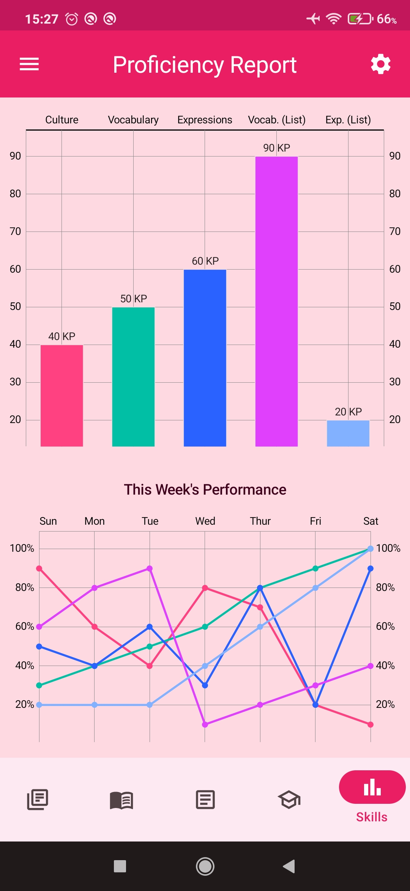

Hi there 👋

Thank you for stopping by. I'm Diego, an <strong>Android Developer</strong> who loves coffee and games. Check out <a href="https://play.google.com/store/apps/dev?id=6824525377690928021">my projects at the PlayStore</a> and feel free to explore my repositories here as well.

⭐ Skills: 

I'm currently refactoring my first project <a href="https://play.google.com/store/apps/details?id=br.lord.dark.vamosparaojapao.free">"Let's go to Japan"</a> to Jetpack Compose: 🚀

📢 Find me elsewhere:

My latest project: Master Proficiency - a website for improving your skills in the English language.
