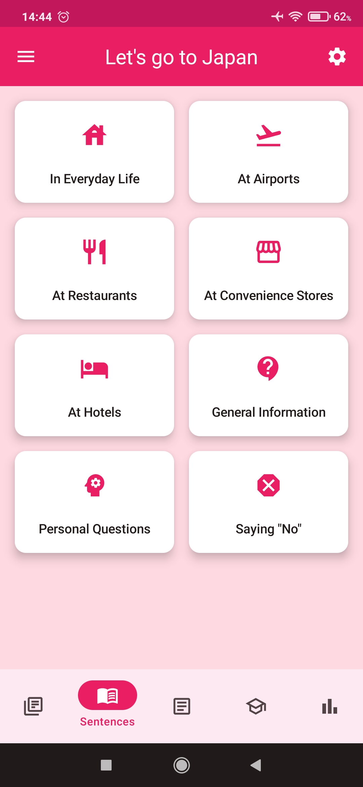

### Hi there 👋

 
  Thank you for stopping by. I'm Diego, an <strong>Android Developer</strong> who loves coffee and games. Check out<a href="https://play.google.com/store/apps/dev?id=6824525377690928021"> my projects at the PlayStore</a> and feel free to explore my repositories here as well.

  ⭐ Skills:  

 </a> <a href="#"> <a href="#"> <a href="#">          <a href="#">    
<a href="#"> 
<a>   <a href="#">   

| Overall Discipline | Most Used Languages|
| -------- | ------- |
| ||

 

<h2>I'm currently refactoring my first project <a href="https://play.google.com/store/apps/details?id=br.lord.dark.vamosparaojapao.free">"Let's go to Japan"</a> to Jetpack Compose: 🚀 </h2>

<a href="#"> <a href="#"> <a href="#">

 

### 📢 Find me elsewhere:

 
